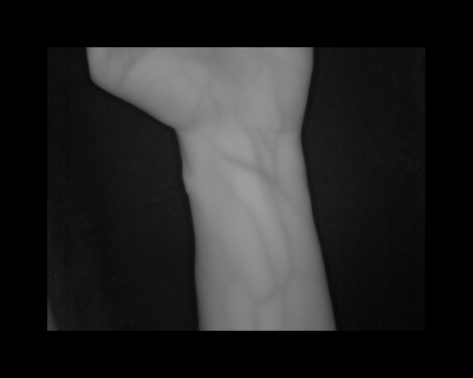
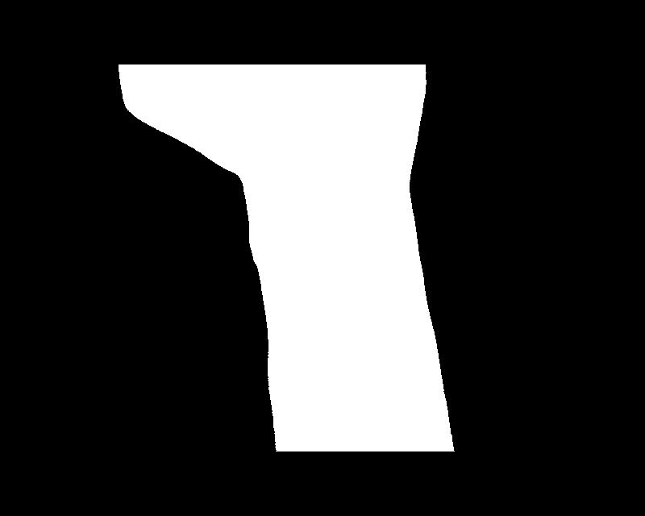
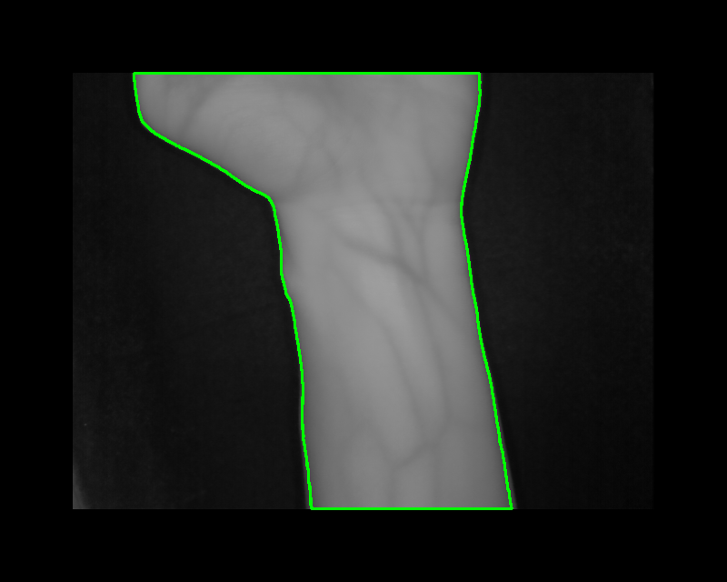
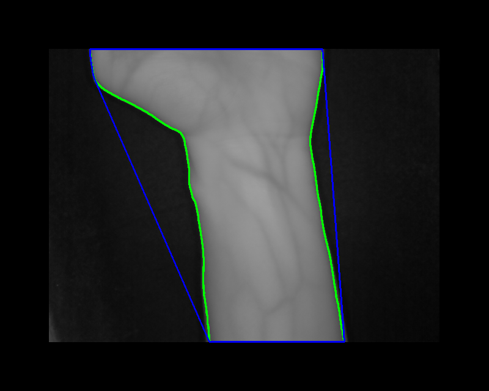
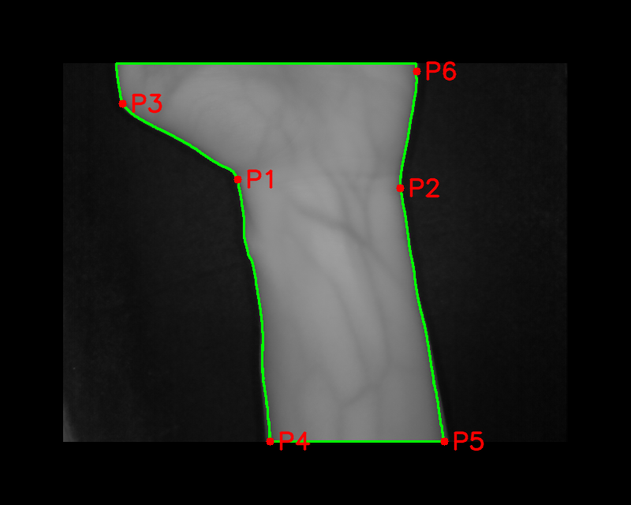
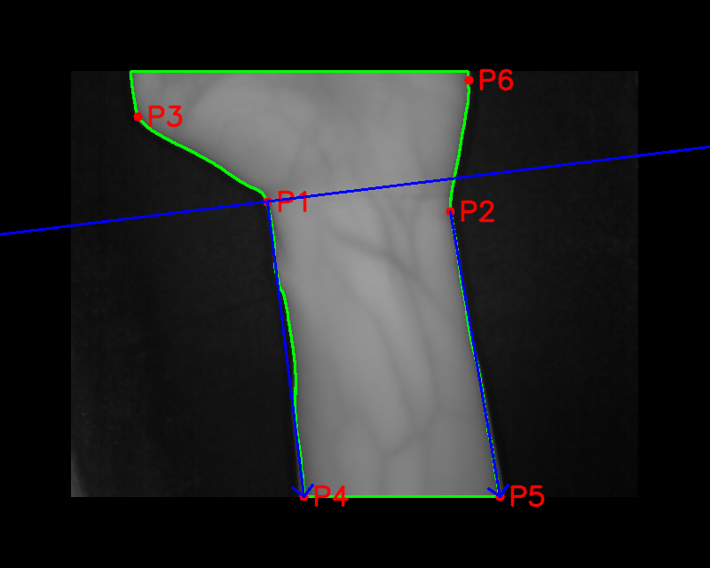
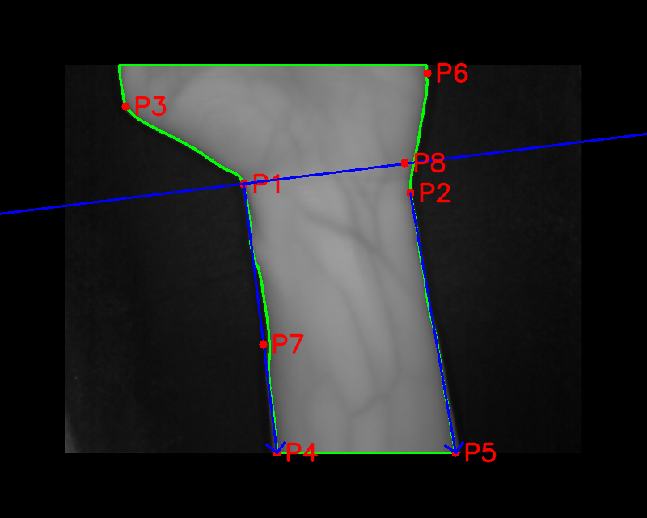
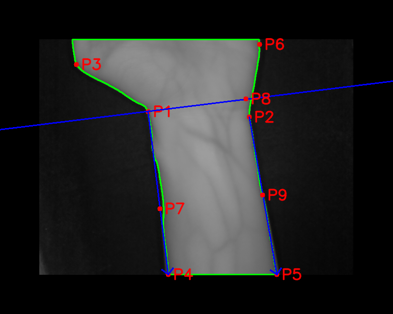
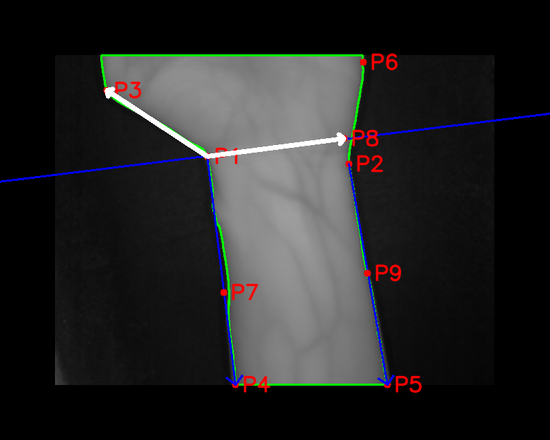
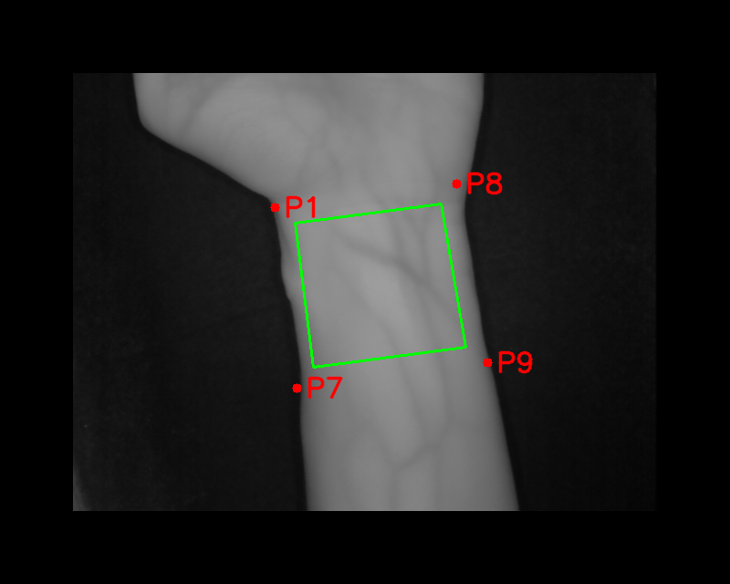

## 📝 Wrist ROI(Region of Interest) Extraction
Python implementation of the wrist ROI(Region of Interest) extraction algorithm.

The detailed algorithm design process is documented on pages 27–44 of my master’s thesis: [Master’s thesis link](https://etheses.lib.ntust.edu.tw/thesis/detail/2b733280676d7c87e0445313c40a9b74/?seq=2#)

### 📁 Contents
- `wrist_roi_extraction.py` - primary execution script.
- `requirements.txt` - lists environment dependencies.
 
## 📊 Sample Result
| Input Image | 1. Padded Image | 2. Otsu Binary Mask |
|-------------|--------------|-------------------|
|  |  |  |

| 3. Largest Contours | 4. Convex Hull | 5. Convexity Defects (P1 and P2) |
|---------------|------------|----------------|
|  |  |  |

| 6. Edge Vectors & Line | 7. P7 Extension Point | 8. P8 Intersection Point |
|---------------|------------|----------------|
|  |  |  |

| 9. P9 Extrapolation Point | 10. Angle & Orientation Check | 11. Scaled ROI |
|---------------|------------|----------------|
|  |  |  |

| 12. Final ROI (128 × 128) |
|---------------|
|  |

## 🚀 Getting Started
To set up the environment (optional if already installed), run:
```
pip install -r .\requirements.txt
```
Replace the captured_img in wrist_roi_extraction.py with your input image path, then run:
```
python .\wrist_roi_extraction.py
```
