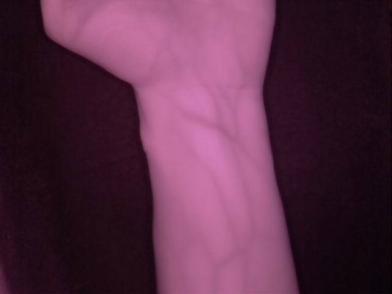

## 📝 Wrist ROI(Region of Interest) Extraction
Python implementation of the wrist ROI(Region of Interest) extraction algorithm

### 📁 Contents
- `wrist_roi_extraction.py` - primary execution script.
- `requirements.txt` - lists environment dependencies.
 
## 📊 Sample Result
| Input Image | 1. Padded Image | 2. Thresholded Image |
|-------------|--------------|-------------------|
|  |  |  |

| 3. Contour Image | 4. Hull Image | 5. Defects Image |
|---------------|------------|----------------|
|  |  |  |

| 6. Line Image | 7. P7 Image | 8. P8 Image |
|---------------|------------|----------------|
|  |  |  |

| 9. P9 Image | 10. Angle Direction Image | 11. Scaled ROI Image |
|---------------|------------|----------------|
|  |  |  |

| 9. ROI Image |
|---------------|
|  |

## 🚀 Getting Started
To set up the environment (optional if already installed), run:
```
pip install -r .\requirements.txt
```
Replace the image_path in vein_enhance.py with your input image path, then run:
```
python .\wrist_roi_extraction.py
```
